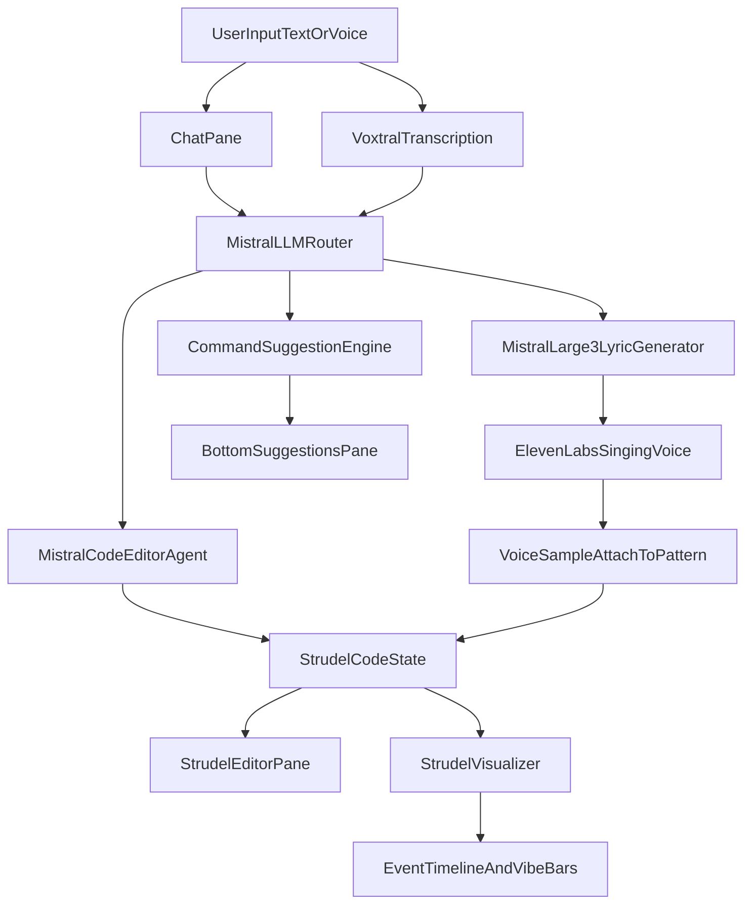

# Next.js Strudel Agent App Plan

## Scope and baseline

- Start from scratch with **Next.js + TypeScript + App Router**.
- Use direct Strudel integration via `@strudel/repl` (`<strudel-editor>`) so the editor pane can be tightly coupled to app state and visualizers.
- Reuse existing command semantics from [docs/CHAT_COMMANDS.md](docs/CHAT_COMMANDS.md) and Strudel constraints from [docs/STRUDEL_REPL.md](docs/STRUDEL_REPL.md).

## Target architecture

## Implementation plan

### 1) Project bootstrap and dependency foundation

- Initialize app shell and install core packages: Next.js, TypeScript, UI primitives, pane splitter library, Strudel (`@strudel/repl`, `@strudel/core`), `@strudel-studio/visualizer`, and Mistral SDK.
- Create initial module boundaries for UI, audio, agent APIs, and shared command types.
- Define env contract (`MISTRAL_API_KEY`, `ELEVENLABS_API_KEY`, optional `NEXT_PUBLIC_*` non-secret values) and runtime validation.

### 2) Three-pane responsive workspace UI

- Build a top area with two vertical panes and a bottom horizontal pane:
  - Left: Strudel code editor + play/stop state + visualization (event timeline and vibe bars via `@strudel-studio/visualizer`).
  - Right: chat/voice interaction panel.
  - Bottom: command suggestions panel with mode selector (`Text`/`Voice`, `T`/eye icon behavior).
  - Header/toolbar: UsageIndicator (percentage of API limit used per service); link to Settings page.
- Implement resizable split panes and persistent pane sizes in local storage.
- Add app-level state store for current code, active transport state, input mode, and suggestion list.
- **Responsive layout** (the three-pane layout may not work on small screens):
  - **Breakpoints**: Use Tailwind defaults or custom: `md` (768px), `lg` (1024px). Below `lg`: stack left and right panes vertically (editor on top, chat below). Below `md`: single-column stack; consider collapsing or hiding the suggestions pane by default.
  - **Suggestions pane on mobile**: Use a **bottom sheet** or **drawer**—tap/click a floating button or toolbar icon to open. Content slides up from the bottom (or in from the side). Keeps the main workspace uncluttered on small viewports while keeping suggestions accessible. Use a library (e.g. `vaul`, `radix-ui`, or custom) or CSS-only slide-up panel.

### 3) Strudel editor integration and music feedback

- Integrate `@strudel/repl` into a React client component wrapper.
- Add controlled code synchronization so agent edits update editor content safely.
- Integrate visualization using `@strudel-studio/visualizer`:
  - **Event timeline + vibe bars**: Single `StrudelVisualizer` component (or `useStrudelVisualizer` hook for custom rendering). Parses Strudel code, derives events, and displays frequency-style bars driven by event structure—no scheduler tap required. Pass `code` and `isPlaying` from workspace state.
  - **Package**: MIT license; depends on `@strudel/core` as peer (AGPL applies when playing audio). Supports mini-notation, stacks, modifiers, FX; ~25% of Strudel API fully implemented—sufficient for most patterns.
- **Fallback**: If custom timeline or piano-roll is needed later, use `pattern.queryArc(start, end)` and render with D3/SVG or Canvas. Requires evaluating code and syncing with scheduler time.
- **Future enhancement**: Real spectrum from actual audio via Web Audio `AnalyserNode`—insert between Strudel output and destination when using `@strudel/web` with custom output setup. Defer to post-MVP.

### 4) Chat and voice command pipeline

- Build chat composer with message history and command confirmation.
- Implement push-to-talk voice input: record audio clip → upload when released → Voxtral batch transcription → send text to agent. Clear recording states and transcription preview. Enforce max 60 s recording in UI (auto-stop or visual countdown).
- Browser captures audio via `MediaRecorder` (WebM) and POSTs the blob to `/api/transcribe`.
- Implement mode-aware command entry (text or voice) tied to the bottom suggestions UX.
- Normalize all input types into a common command request object before backend execution.

### 5) Intent routing and agent flow

- **LLM-based routing**: The IntentAndCommandRouter is powered by Mistral. User text (from chat or voice transcript) is sent to Mistral, which interprets natural language and returns structured output (e.g. JSON with `intent`, `params`, or direct Strudel code edits). No rule-based keyword matching—Mistral handles intent disambiguation and routing.
- **Flow**: User instruction + current Strudel code → Mistral chat completion with system prompt (CHAT_COMMANDS semantics, Strudel syntax) → structured response (intent + params, or code diff, or lyric request) → route to code-editing agent, lyric generator, or singing orchestrator.
- **Structured output**: Use Mistral's JSON mode or a response schema so the model returns `{ intent: "add_reverb" | "add_voice_sample" | "transpose" | ...; params?: {...}; codePatch?: string }` for deterministic downstream handling.
- **Guardrails**: Apply bounds from [docs/CHAT_COMMANDS.md](docs/CHAT_COMMANDS.md) after LLM output; if intent is low-confidence or unsupported, ask clarifying question or suggest nearest supported command.

### 6) Backend AI routes and orchestration

- Add App Router API routes for:
  - **Voice transcription**: `POST /api/transcribe` — accepts uploaded audio (see audio constraints below), forwards to Mistral `POST /v1/audio/transcriptions` with `model: "voxtral-mini-latest"`, returns full transcript. Optional: set `stream: true` on the Mistral call to receive incremental text and show it in the UI while the file is processed.
- **Audio upload constraints** (for `/api/transcribe`):
  - **Formats**: Primary format WebM (Chrome/Firefox `MediaRecorder` default). Safari may produce WebM or MP4; Mistral docs show MP3 support—verify WebM acceptance at implementation time; fallback to MP4 or client-side conversion if needed.
  - **Max duration**: 60 seconds (enforced in UI and API). Voxtral supports up to 3 hours; 60 s is sufficient for voice commands and keeps uploads small.
  - **Max file size**: 10 MB (enforced in API). At typical voice bitrates (~128 kbps), 60 s ≈ 1 MB; 10 MB leaves headroom. Mistral Files API allows up to 512 MB; our limit protects server and gives clear user feedback.
  - Music-edit agent via Mistral model (instruction + current Strudel code -> patch/new code + explanation).
  - Lyric generation via Mistral Large 3 with duration constraints.
  - **Singing sample generation** via ElevenLabs (see ElevenLabs spec below).
- Add orchestration step for "add voice sample": parse intent -> build LyricTimingContext from current pattern (cps, bpm, barCount, targetDurationSeconds) -> Mistral generates lyric with target syllable count -> ElevenLabs synthesizes lyric text (free-form) with chosen singing voice -> host audio and inject sample reference into Strudel pattern.
- **ElevenLabs Singing AI spec**:
  - **Endpoint**: Standard TTS `POST https://api.elevenlabs.io/v1/text-to-speech/{voice_id}`. Singing voices are regular voice IDs from the library; same API, different voice selection.
  - **Custom lyrics**: Pass lyric text in the JSON `text` field. There is no preset vs custom mode—you always send your own text. Mistral Large 3 generates the lyric; we pass it directly to ElevenLabs.
  - **Voice selection**: Use `GET /v1/voices` to list voices; filter by labels (e.g. `use_case: "singing"`) or curate a small set of known singing voice IDs (e.g. The Soulful Songstress, The Pop Princess, The Blues Legend). Store default and allow optional user override.
  - **Model**: `eleven_multilingual_v2` (default) or `eleven_turbo_v2` for lower latency. Verify `eleven_multilingual_v2` supports singing; fallback to `eleven_turbo_v2` if needed.
  - **Duration alignment with Strudel** (no direct "duration in seconds" API param):
    - **Lyric length**: Mistral receives target duration (seconds) and BPM/cycle info from current Strudel pattern. Prompt: generate lyrics with roughly N syllables (rule of thumb ~2–3 syllables/second at normal singing pace). E.g. 8 bars at 120 BPM = 16 s → ~32–48 syllables.
    - **Speed adjustment**: Use `voice_settings.speed` (e.g. 0.8–1.2) to stretch or compress output if the first synthesis is too long/short.
    - **Optional refinement**: Generate → synthesize → measure output duration → if off-target, adjust lyric or speed and re-synthesize once.
  - **Output format**: Request `mp3_44100_128` or `wav_44100` for Strudel. Return URL or base64 for client; host blob (e.g. Vercel Blob, `/api/singing` returns signed URL) so Strudel can load the sample.
- **Lyric–audio timing contract**:
  - **Inputs to Mistral Large 3 (lyric generator)**:
    - Cycle length (seconds per cycle, from `setcps` or `cpm`/`bpm`).
    - BPM (derived from `cpm` or `bpm` in pattern).
    - Bar count (e.g. 4, 8, 16 bars for the vocal phrase).
    - Target duration in seconds (computed as `barCount * 4 / cps` or equivalent).
  - **Mistral output**: Lyric text with approximate target syllable count (~2–3 syllables/second). No timing/phoneme data required.
  - **Inputs to ElevenLabs (synthesis)**: ElevenLabs accepts **free-form lyric text** in the `text` field. It does not require timing or phoneme data—plain text only. Duration control is via lyric length + `voice_settings.speed`.
  - **Data flow**: Strudel code → extract `cps`, `bpm`, `barCount` (parse or infer default) → compute `targetDurationSeconds` → pass to `/api/lyrics` → Mistral returns lyric with target syllables → pass lyric to `/api/singing` → ElevenLabs returns audio → optional: measure duration, adjust `speed` and re-synthesize if off-target.
  - **Implementation**: Define a `LyricTimingContext` type `{ cps, bpm, barCount, targetDurationSeconds, targetSyllables? }` and pass it from orchestration to lyric API; lyric API includes it in the Mistral prompt.
- Enforce guardrails (bounded params, unsupported intent fallback) per [docs/CHAT_COMMANDS.md](docs/CHAT_COMMANDS.md).

### 7) Suggestion engine and command UX

- Seed suggestions from [docs/CHAT_COMMANDS.md](docs/CHAT_COMMANDS.md) grouped by transport/tempo/rhythm/melody/fx/arrangement.
- Make suggestions contextual to currently playing code (e.g., show `add reverb` only when room is absent or low).
- Support one-click suggestion insertion for text mode and one-tap spoken prompt templates for voice mode.

### 8) Cost, usage limits, and settings

- **Cost and usage limits** (Mistral, ElevenLabs, Voxtral are paid):
  - **Limits per route**: Max audio duration (60 s for transcribe); max requests per period (configurable per service). API routes enforce server-side limits; optional client-side caps before sending requests.
  - **Optional pre-request warning**: e.g. "This request will use 1 Mistral call + 1 ElevenLabs synthesis (~30s audio)" before voice-sample orchestration.
- **Settings page** (`/settings` or `app/settings/page.tsx`):
  - **API keys**: Form fields for Mistral and ElevenLabs keys. Keys are sent to backend and stored server-side (encrypted or in a secure store); never exposed to client. Fallback: use `.env` keys if settings are empty (for dev/self-hosted). Include link to obtain keys and security notice.
  - **Usage limits**: User-defined limits per service (e.g. Mistral: 100 requests/day, ElevenLabs: 10 min audio/month). Stored in localStorage or backend. Reset on period boundary (daily/monthly).
- **Usage visualizer** (during music creation):
  - Show a compact bar or indicator (e.g. in header, sidebar, or near chat) with percentage of configured limit used per service (Mistral, ElevenLabs, Voxtral).
  - Track usage: increment on successful API responses (backend returns `usage` metadata, or client infers from request type). Persist counts in localStorage; reset when period rolls over.
  - Visual states: green (under limit), yellow (e.g. >80%), red (at/over limit, optionally block new requests). Optional: expandable tooltip with breakdown (transcriptions, code edits, lyrics, singing).

### 9) Reliability, observability, and safety

- Add request-level logging with redaction for audio and API keys.
- Add graceful degradation for failed transcription/voice synthesis.
- Add undo/redo code snapshots and “what changed” diff responses in chat.
- Add rate limiting and payload size limits (10 MB, 60 s duration) on `/api/transcribe` per the audio constraints above.

### 10) Validation and delivery

- Create an end-to-end happy path test: type command -> code updates -> audio/visual update.
- Create voice path test: push-to-talk -> upload -> Voxtral transcript -> code change.
- Create voice-sample path test: request vocal line -> timed lyric -> ElevenLabs output -> pattern inclusion.
- Write setup and usage docs with `.env` contract and local run instructions.

## Planned file map

- App shell and layout:
  - [app/layout.tsx](app/layout.tsx)
  - [app/page.tsx](app/page.tsx)
  - [app/settings/page.tsx](app/settings/page.tsx) — API keys form (Mistral, ElevenLabs); user-defined usage limits; stored server-side / localStorage
- Core UI components:
  - [components/workspace/SplitWorkspace.tsx](components/workspace/SplitWorkspace.tsx) — resizable panes; responsive breakpoints (stack at md/lg); suggestions as bottom sheet/drawer on mobile
  - [components/strudel/StrudelEditorPane.tsx](components/strudel/StrudelEditorPane.tsx)
  - [components/chat/ChatPane.tsx](components/chat/ChatPane.tsx)
  - [components/chat/VoiceInput.tsx](components/chat/VoiceInput.tsx) — push-to-talk, MediaRecorder (WebM), 60 s max, upload to /api/transcribe
  - [components/suggestions/SuggestionsPane.tsx](components/suggestions/SuggestionsPane.tsx) — bottom sheet/drawer on mobile; inline at bottom on desktop
  - [components/visualizers/StrudelVisualizerPane.tsx](components/visualizers/StrudelVisualizerPane.tsx) — wraps `@strudel-studio/visualizer` `StrudelVisualizer`; passes `code`, `isPlaying`, `cps` from workspace; optional custom render via `useStrudelVisualizer` hook
  - [components/usage/UsageIndicator.tsx](components/usage/UsageIndicator.tsx) — bar/indicator showing % of limit used per service (Mistral, ElevenLabs, Voxtral); green/yellow/red states; expandable breakdown
- API routes:
  - [app/api/transcribe/route.ts](app/api/transcribe/route.ts) — accepts WebM/MP4 (max 10 MB, ~60 s), forwards to Voxtral; optional `stream: true` for incremental transcript display
  - [app/api/agent-edit/route.ts](app/api/agent-edit/route.ts) — Mistral interprets intent (LLM-based routing) and returns structured output or code patch
  - [app/api/lyrics/route.ts](app/api/lyrics/route.ts) — Mistral Large 3; receives LyricTimingContext (cps, bpm, barCount, targetDurationSeconds); outputs lyric with target syllable count
  - [app/api/singing/route.ts](app/api/singing/route.ts) — ElevenLabs TTS `POST /v1/text-to-speech/{voice_id}`; accepts lyric text, voice_id, optional speed; returns audio URL/blob for Strudel
  - [app/api/settings/route.ts](app/api/settings/route.ts) — GET/POST for API keys and usage limits (server-side secure store); returns usage metadata for client tracking
- Domain logic:
  - [lib/commands/commandSchema.ts](lib/commands/commandSchema.ts) — structured intent schema for LLM response (intent, params, codePatch)
  - [lib/lyrics/timingContext.ts](lib/lyrics/timingContext.ts) — LyricTimingContext type; helpers to extract cps/bpm/barCount from Strudel code
  - [lib/commands/suggestionEngine.ts](lib/commands/suggestionEngine.ts)
  - [lib/strudel/eventAdapter.ts](lib/strudel/eventAdapter.ts) — optional; for custom `queryArc`-based timeline or piano-roll if needed later
  - [lib/ai/mistralClient.ts](lib/ai/mistralClient.ts) — includes Voxtral batch transcription via `audio.transcriptions`
  - [lib/ai/elevenLabsClient.ts](lib/ai/elevenLabsClient.ts) — TTS convert, voice list (filter singing), voice_settings.speed for duration adjustment
  - [lib/state/workspaceStore.ts](lib/state/workspaceStore.ts)
  - [lib/usage/usageTracker.ts](lib/usage/usageTracker.ts) — track API usage per service; persist in localStorage; reset on period; compute % vs user limits
- Documentation:
  - [docs/ARCHITECTURE.md](docs/ARCHITECTURE.md)
  - [docs/SETUP.md](docs/SETUP.md)

