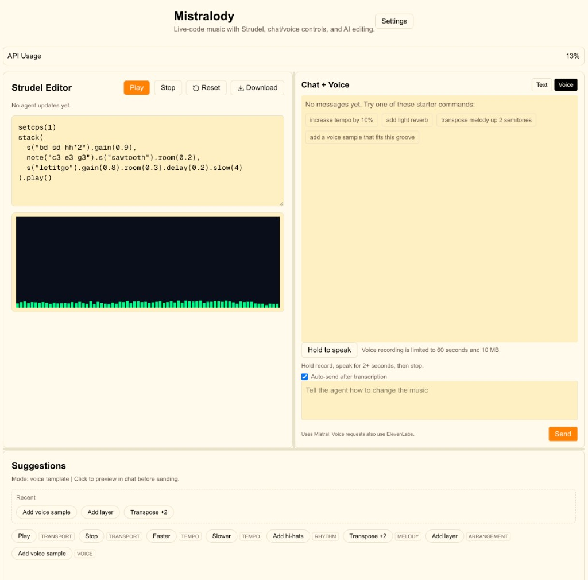

# Mistralody

**Live-code music by talking to it.** Describe what you want, speak it, or click—Mistralody turns your words into Strudel patterns and ElevenLabs singing, instantly.



## Why Mistralody?

You don’t need to memorize syntax to make music. Tell the AI “add a voice sample that fits this groove” or “sing let it go” and it happens. Ask for “more reverb”, “faster tempo”, or “transpose the melody up”—text or voice—and the code updates in real time. No SuperCollider, no DAW, no manual coding. Just you, your ideas, and a browser.

- **Talk to your music** – Voice or text. Voxtral transcribes; Mistral edits the Strudel code.
- **AI singing** – ElevenLabs turns your lyrics into vocals. “Add a voice sample”, “sing let it go”, or anything that fits the groove.
- **Live Strudel** – Real-time playback, visualizer, and full TidalCycles mini-notation. Edit the code directly when you want control.
- **One workspace** – Editor, chat, voice, and suggestions in one interface. Fast iteration, no context switching.

## Quick start

```bash
git clone <repo-url>
cd mistralody
npm install
cp .env.example .env   # add your API keys
npm run dev
```

Open [http://localhost:3000](http://localhost:3000). Done.

### Environment

Add to `.env`:

```
MISTRAL_API_KEY=your_key
ELEVENLABS_API_KEY=your_key
ELEVENLABS_VOICE_ID=             # optional; pick a voice
NEXT_PUBLIC_APP_NAME=Mistralody
```

Or configure keys and voice ID in **Settings** (`/settings`) after launching.

## What you can do

| Input | Example |
|-------|---------|
| Text | “increase tempo by 10%”, “add light reverb”, “transpose melody up 2 semitones” |
| Voice | Hold record, speak, release. Auto-send optional. |
| Suggestions | One-click: Play, Faster, Add hi-hats, Add voice sample, etc. |

The agent understands transport, tempo, rhythm, melody, FX, arrangement, and voice samples. See [Chat Commands](docs/CHAT_COMMANDS.md) for the full command reference.

## Tech stack

- **Next.js 16** · App Router
- **Strudel** · TidalCycles in the browser
- **Mistral** · Agent edits + Voxtral transcription
- **ElevenLabs** · Singing synthesis
- **Zustand** · Client state

## Documentation

| Doc | Description |
|-----|-------------|
| [Architecture](docs/ARCHITECTURE.md) | Data flow, modules, API layout |
| [Setup](docs/SETUP.md) | Prerequisites, validation, troubleshooting |
| [Chat Commands](docs/CHAT_COMMANDS.md) | Supported commands and semantics |
| [Strudel REPL](docs/STRUDEL_REPL.md) | Strudel integration reference |

## Scripts

```bash
npm run dev     # Dev server (port 3000)
npm run build   # Production build
npm run start   # Production server
npm run lint    # ESLint
```

## License

Strudel packages are AGPL-3.0. If you distribute this app with Strudel enabled, ensure AGPL obligations (source availability and attribution) are met.
